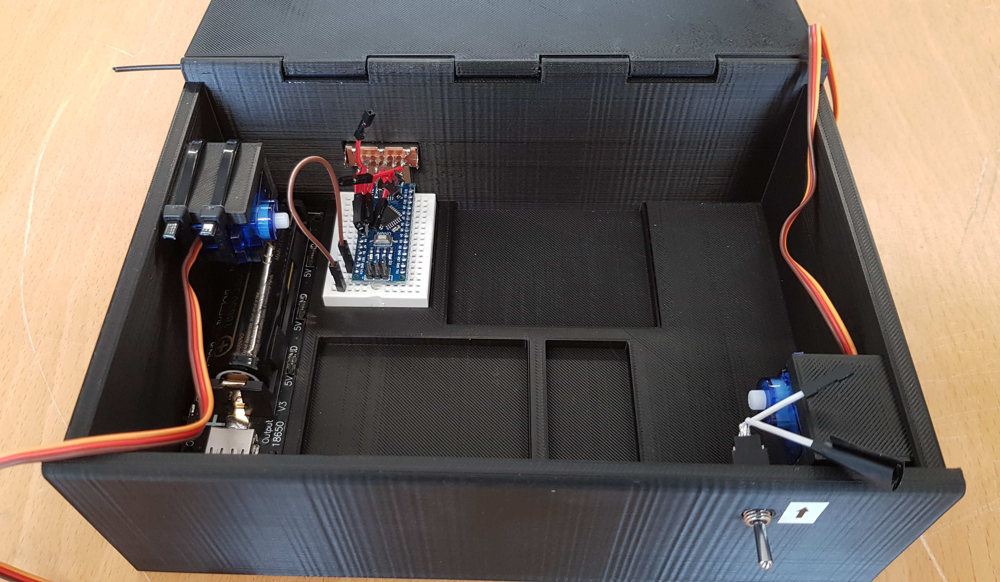
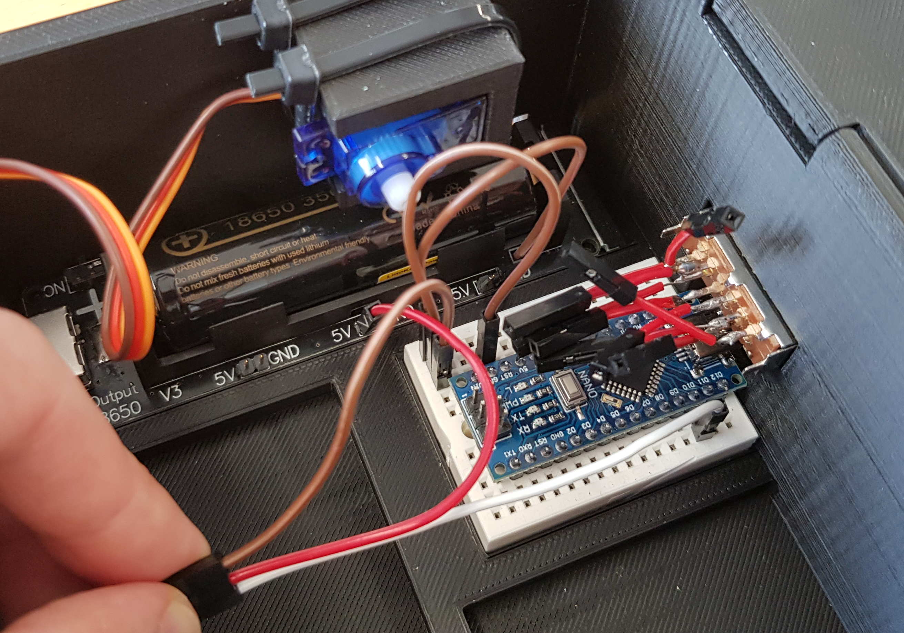
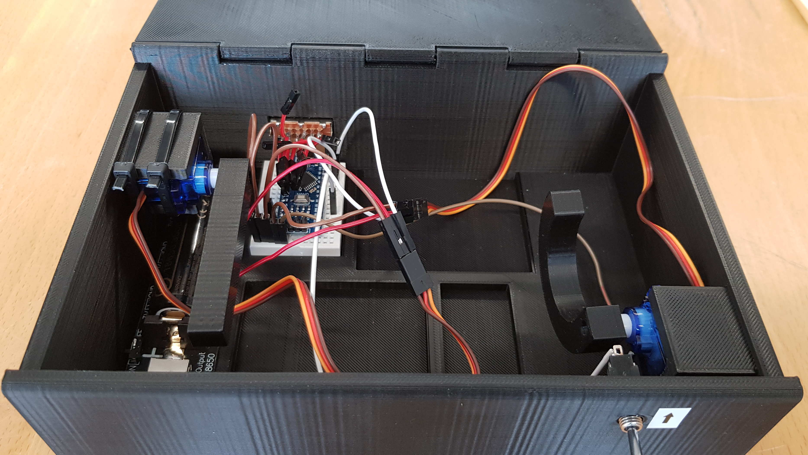

<h1>
 readme: useless_box 
</h1>

 
 
 
 
 

### Table of Contents

1. **[Overview](#1.-Overview)** 

2. **[Resources](#2.-Resources)** 

2. **[Instructions](#3.-Instructions)** 

 
 
 
 
 

# 1. Overview

 
 

This file is meant to provide documentation on the `useless_box` electronics project.
Toggling a switch will trigger two servo motors to open up a box and untoggling the same switch again, utilizing a random funny animation.

 

Features:
* ready-made 3D-printed PLA box
* Arduino NANO microcontroller
* rechargeable battery (Mini USB Typ B), capable of powering both servo motors and the microcontroller

 

This project was created in the context of the physics block lecture `Einführung in die moderne Digitalelektronik` (given by Prof. Dr. Horst Fischer and tutored by myself) during the summer semester 2021 at the Albert-Ludwigs-Universität Freiburg.
I used the project to familiarize myself with how to integrate rechargeable batteries into my microcontroller-powered projects.
In addition this made for a nice birthday present for my fiance ;-) .

 
 
 
 
 

# 2. Resources

 
 

Links:
* Daniele Tartaglia's [YouTube video](https://www.youtube.com/watch?v=5BRDxsO_TuQ) and [written instructions](https://www.labdomotic.com/2017/10/24/youtube-useless-box-fai-da-te/) about his useless box project
* diyi0t's [written introduction](https://diyi0t.com/arduino-nano-tutorial/) to Arduino Nano power supply
* chip.de's [written tutorial](https://praxistipps.chip.de/arduino-bootloader-neu-flashen-so-gehts_101452) on Arduino bootloader flashing
* GreatScott!'s [YouTube video](https://www.youtube.com/watch?v=J3DYgzRvLT8) on ATmega328 dead bug installation
* DroneBot Workshop's [YouTube video](https://www.youtube.com/watch?v=Sww1mek5rHU) on ATmega328 dead bug installation
* [written tutorial](https://www.exp-tech.de/blog/arduino-tutorial-servo) on servo motor control
* [written tutorial](https://www.arduino.cc/en/Tutorial/DigitalInputPullup) on digital pull-up input

 

Parts:
* [sliding switch](https://www.conrad.de/de/p/tru-components-css-1202-schiebeschalter-50-v-dc-0-3-a-1-x-aus-ein-1-st-1569017.html) (0.62€)
* [toggle switch](https://www.conrad.de/de/p/tru-components-tc-r13-2-05-kippschalter-250-v-ac-1-5-a-1-x-aus-ein-rastend-1-st-1587664.html) (1.13€)
* [compartment for four AA batteries](https://www.conrad.de/de/p/tru-components-sbh341-1a-batteriehalter-4x-mignon-aa-kabel-1672572.html) (1.67€)
* [SG90 servo motor (1.8 kg*cm @6V)](https://www.conrad.de/de/p/makerfactory-mf-6402123-motor-2134041.html) (3.55€)
* [SG5010 servo motor (6.5 kg*cm @6V, wrong image in Conrad webshop)](https://www.conrad.de/de/p/adafruit-155-servomotor-1516599.html) (15.99€)
* [ATMEGA328P microcontroller](https://www.conrad.de/de/p/microchip-technology-atmega328p-pu-embedded-mikrocontroller-pdip-28-8-bit-20-mhz-anzahl-i-o-23-155197.html) (2.16€)
* [16MHz quartz resonator](https://www.conrad.de/de/p/euroquartz-quarzkristall-quarz-hc49-us-hc49-4h-16-000-mhz-18-pf-l-x-b-x-h-3-68-x-10-26-x-3-5-mm-1-st-155145.html) (0.54€)
* [2x 22pF capacitors](https://www.conrad.de/de/p/tru-components-tc-k22pf500v-keramik-kondensator-tht-22-pf-500-v-5-1-st-1589526.html) (2x 0.075€)
* set of 3D-printed components: box, lid, lever (`.ipt`, `.stp` and `.stl` files in this repository)

Neglecting the costs for the 3D-print the items above add up to 24.71€

 

This Repository:
* documentation (this file)
* sketch for the Arduino microcontroller
* `.stl` files for the 3D-printed box

 
 
 
 
 

# 3. Instructions

 
 

The following steps will guide you through the assembly of the useless box project.

 
 

#### 3.1 Preparing the Box

 

Slice and 3D-print the box consisting of the files `ub_lever_lid.stl`, `ub_lever_switch.stl`, `ub_box_lid.stl`, and `ub_box_bottom.stl`.
If you have an Ender 3-Pro you can print the respective `.gcode` files right away.
Attach the lid to the bottom part of the box.
Therefore insert a PLA string (diameter: 1.75 mm) into the foreseen perforations, functioning as a hinge.

 

Insert the servo motors into the foreseen perforations and fixate them with cable ties.

 

Also insert both the toggle switch and the three-state power switch into their foreseen perforations.
Solder female jumper wires to their pins.

 

Install the Arduino Nano board onto the small breadboard with its USB port positioned in the topmost row, facing towards the foreseen perforation (like depicted below). Afterwards glue the breadboard in place.
Connect the Arduino `GND` pin to the unoccupied lowermost row of the breadboard.
All grounded components need to be connected to this common ground potential `GND`.

 

 
 

#### 3.2 Wiring the Servo Motors and Toggle Switch

 

The two servo motors `servo_lid` and `servo_switch` will each agitate levers that move the lid of the box and switch off the toggle switch, respectively.
The two utilized servo motors each come with three wires:
* `GND` (black/brown): Connect to the common ground `GND` of the box (see the section above).
* `PWM`(yellow/orange): Connect to two digital `PWM` pins of the Arduino (here `D9` and `D10`).
* `5V` (red): Connect to two of the 5 V outputs of the rechargeable battery.

 

NOTE: The servo motors cannot be powered off the 5 V pin of the Arduino board due to the limited current it provides. Here the 5 V outputs of a rechargeable LiPo battery have been used. Alternatively you can also power the servo motors with four AA batteries in series, adding up to 6 V in total.

 

Connect one pin of the toggle switch to the common ground `GND` and the other one to a digital pin on the Arduino board (here: `D2`).

 

 
 

#### 3.3 Software Setup and Lever Orientation

 

Now connect the Arduino Nano board to your computer via USB and open the `useless_box.ino` sketch in the Arduino IDE.
Eventually adapt the pin numbers for the toggle switch (`switch_pin`, here: `D2`), the servo moving the box lid (`servo_lid_pin`, here: `D10`), and the servo moving the toggle switch (`servo_switch_pin`, here: `D9`).
Then upload the modified sketch to the Arduino Nano board to program the microcontroller.
You should now be able to trigger the two servos by toggling the toggle switch.

 

Next, the levers are mounted to the servos.
Therefore trigger a closing animation by toggling the switch and once the animation is done, unplug the USB cable, such that the servos remain in their rest position.
Glue the small plastic levers that come with the servo motors into foreseen perforations of the 3D-printed levers.
Then attach the levers to the servos:
Make sure that the lever of the lid servo is oriented horizontally, pointing towards the front of the box, when resting.
The switch servo lever should be oriented vertically, pointing towards the bottom of the box, when resting.
If you now power on the Arduino board via USB and trigger a animation by toggling the switch, the levers should open the box, untoggle the switch and close the box again.
If not, then you'd need to adjust the lever position.
If you are happy with the design, screw the levers onto the servo motors through the foreseen perforations, using the tiny screws that come with the servos.

 

 
 

#### 3.4 Final Steps

 

The perforation above the cutout for the Arduino Nano on the breadboard holds the three-state power switch.
Depending on whether the switch is locked in its leftmost, center, or rightmost position, it will connect the single pins with the two leftmost, center, or rightmost pins, respectively.
Connect the left pin of the left array to the common ground `GND`.
Remove the servo ground connections and connect them to the single pin corresponding to the left array instead. You can now turn the servo motor power supply on and off - simulataneously for both motors.

 

Finally it would be super neat, if one could also power the Arduino Nano board with the rechargeable battery.
Therefore connect the only yet unconnected 5 V output of the battery pack to the leftmost pin of the onoccupied right array of the three-state switch. The corresponding single pin of the right array needs to be connected to the `5V` pin of the Arduino Nano board. The same power switch can now simultaneously turn off and on the power supply for both servos and the microcontroller board.
WARNING: Don't switch the box on and connect the Arduino Nano to a computer via USB at the same time; you might irreversibly damage the board.

 

Under `useless profiles` in the `useless_box.ino` sketch you can now add your own animations.

 

If you also have a plushy to spare, cut off its head and arm to give the box a nice appearance.

 
 
 
 
 

